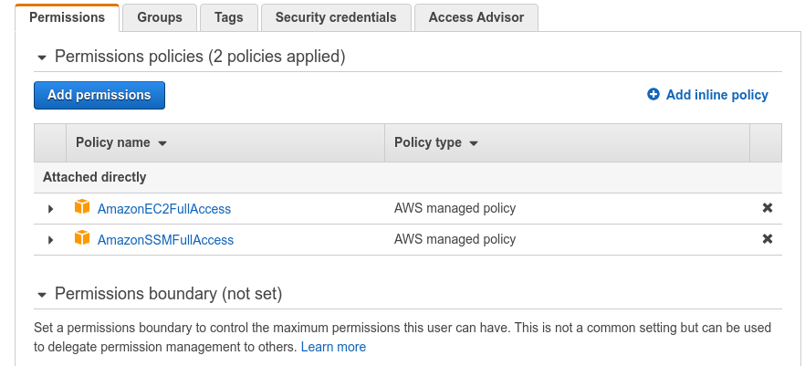
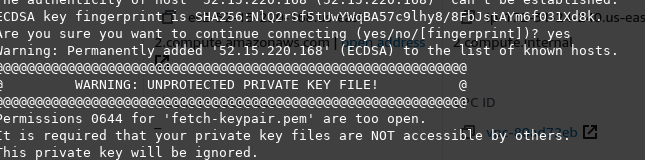

# Fetch Rewards Coding Assessment - Site Reliability Engineer

Author: Bobak Hadidi

Email: bobak.hadidi@gmail.com

## Description

Develop an automation program that takes a YAML configuration file as input and deploys a Linux AWS EC2 instance with two volumes and two users.

Here are some guidelines to follow:

- Create a YAML file based on the configuration provided below for consumption by your application
- You may modify the configuration, but do not do so to the extent that you fundamentally change the exercise
- Include the YAML config file in your repo
- Use Python and Boto3
- Do not use configuration management, provisioning, or IaC tools such as Ansible, CloudFormation, Terraform, etc.

## Requirements

We must be able to:

1. Run your program
2. Deploy the virtual machine
3. SSH into the instance as user1 and user2
4. Read from and write to each of two volumes

Please assume the evaluator does not have prior experience executing programs in your chosen language or creating virtual machines via your chosen deployment method. Therefore, please include any documentation necessary to accomplish the above requirements.

## Usage and Testing

Ensure python and pip and awscli, boto3, and pyyaml are available from your console. On Ubuntu:

`sudo apt-get install python3`

`pip install awscli boto3 pyyaml`

First, set up your AWS credentials, **access type : Programmatic access**.

You will want to configure your user's policy with full permissions to EC2, similarly [as described](https://blog.ipswitch.com/how-to-create-an-ec2-instance-with-python).

In the image below AmazonSSMFullAccess permissions policy is also attached, like so.

  

The script will provision and deploy the instance using `config.yaml` by default.

`python deploy.py`

The image may take a minute to initialize. (**Pending** status)

A key-pair is created `fetch-keypair.pem`.
If you see this error,

  

Be sure to change the mode to read-only.

`chmod 400 fetch-keypair.pem`

SSH into the instance with the new keypair or your user1 or user2 keypair.

`ssh -i fetch-keypair.pem ec2-user@--instance public ip goes here--`

`ssh -i mykeypair.pem user1@--instance public ip goes here--`

## Resources

https://boto3.amazonaws.com/v1/documentation/api/latest/index.html
https://docs.aws.amazon.com/IAM/latest/UserGuide/id_users_create.html#id_users_create_console
https://blog.ipswitch.com/how-to-create-an-ec2-instance-with-python
https://docs.aws.amazon.com/AWSEC2/latest/UserGuide/authorizing-access-to-an-instance.html
https://boto3.amazonaws.com/v1/documentation/api/latest/guide/ec2-example-security-group.html
https://docs.aws.amazon.com/AWSEC2/latest/UserGuide/ec2-key-pairs.html#how-to-generate-your-own-key-and-import-it-to-aws
